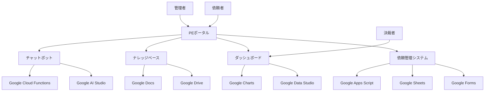
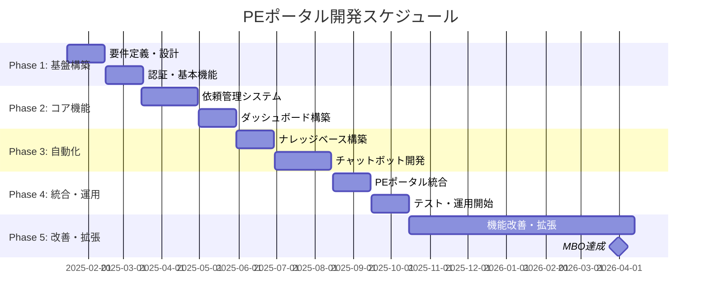

# PEポータル開発プロジェクト企画書
## システム依頼・業務可視化基盤の確立

**作成日**: 2025年1月14日  
**プロジェクト期間**: 2025年1月〜2026年3月  
**MBO達成期限**: 2026年3月31日  

---

## 📋 エグゼクティブサマリー

### プロジェクト概要
PEポータル開発プロジェクトは、システム依頼のボトルネック解消と業務プロセスの可視化・自動化を実現する基盤システムの構築を目的とします。**追加コストをかけず**、既存のGoogle Workspace環境を最大限活用し、AI駆動開発により効率的に開発を進めます。

### 期待される効果
- **システム依頼の処理時間**: 50%短縮
- **意思決定プロセスの透明性**: 100%向上
- **業務可視化**: リアルタイム化
- **一次対応の自動化率**: 80%達成

### 投資対効果
- **初期投資**: ほぼゼロ（既存リソース活用）
- **年間運用コスト**: ほぼゼロ
- **ROI**: 無限大（投資なしで大幅な効率化）

---

## 🎯 背景と目的

### MBO達成目標
持続可能なチーム運用基盤の確立。以下の6つのタスクを完遂し、PEポータルサイトの基礎開発を完了し運用を開始する。

| No. | MBOタスク | 達成基準 |
|-----|-----------|----------|
| (1) | 依頼フローの統一 | 専用フォーム作成・運用 |
| (2) | 稼働状況の可視化 | ダッシュボード構築 |
| (3) | 意思決定プロセスの確立 | 定例会議での決裁仕組み化 |
| (4) | ナレッジの整備 | マニュアル/FAQスコープ定義、AI参照形式設計 |
| (5) | 一次対応の自動化 | FAQシステム/チャットボット構築・リリース |
| (6) | PEポータルの開発 | 全機能集約・搭載した基礎開発完了と運用開始 |

### 解決すべき課題（As-Is）

#### 🔴 現状の問題
1. **システム依頼のボトルネック化**
   - 特定の担当者（私自身）に依頼が集中
   - 依頼の質がばらつき、処理時間が不透明
   - 適切な依頼方法や窓口が不明確

2. **リソース状況の不明瞭さ**
   - 担当者の稼働状況が可視化されていない
   - 決裁者がプロジェクトの実行可否を判断できない
   - 優先順位の決定が困難

3. **業務プロセスの非効率性**
   - 手動での依頼管理
   - 意思決定プロセスの不透明性
   - ナレッジの散在

### 目指す姿（To-Be）

#### 🟢 理想の状態
1. **標準化された依頼フロー**
   - 統一されたフォームによる依頼受付
   - 自動的な優先順位付け
   - リアルタイムな進捗管理

2. **完全可視化された業務状況**
   - リアルタイムダッシュボード
   - リソース稼働状況の透明性
   - データドリブンな意思決定

3. **自動化された一次対応**
   - AIチャットボットによるFAQ対応
   - ナレッジベースの自動更新
   - 人的リソースの効率的活用

---

## 🏗️ PEポータル構想

### システム全体アーキテクチャ

### MBOタスク実現方法

#### (1) 依頼フローの統一
- **技術**: Google Forms + Google Apps Script
- **機能**: 
  - 標準化された依頼フォーム
  - 自動的な依頼ID発行
  - 優先順位の自動判定
  - 進捗状況の自動更新

#### (2) 稼働状況の可視化
- **技術**: Google Data Studio + Google Sheets
- **機能**:
  - リアルタイムダッシュボード
  - 依頼処理状況の可視化
  - リソース稼働率の表示
  - トレンド分析

#### (3) 意思決定プロセスの確立
- **技術**: Google Calendar + Google Apps Script
- **機能**:
  - 定期的な決裁会議の自動設定
  - 議題の自動生成
  - 決裁結果の記録・追跡
  - アクションアイテムの管理

#### (4) ナレッジの整備
- **技術**: Google Drive + Google Docs + AI
- **機能**:
  - 構造化されたナレッジベース
  - AI参照形式の設計
  - 自動的なドキュメント更新
  - 検索・分類機能

#### (5) 一次対応の自動化
- **技術**: Google AI Studio + Google Cloud Functions
- **機能**:
  - AIチャットボット
  - FAQ自動回答
  - エスカレーション機能
  - 学習機能

#### (6) PEポータルの開発
- **技術**: Google Sites + Google Apps Script
- **機能**:
  - 全機能の統合
  - シングルサインオン
  - レスポンシブデザイン
  - モバイル対応

---

## 🛠️ 技術選定と推奨案

### 技術選定方針
**「追加コストゼロ」**を最優先とし、既存のGoogle Workspace環境を最大限活用

### 推奨技術スタック

| カテゴリ | 技術 | 理由 |
|---------|------|------|
| **フロントエンド** | Google Sites | 無料、簡単、Google Workspace統合 |
| **バックエンド** | Google Apps Script | 無料、JavaScript、Google API統合 |
| **データベース** | Google Sheets | 無料、既存スキル活用 |
| **認証** | Google Workspace SSO | 既存アカウント活用 |
| **AI機能** | Google AI Studio | 無料枠内で利用可能 |
| **開発環境** | Cursor AI | 既存アカウント活用 |

### セキュリティ設計

#### アクセス制御
- **社員**: 会社のGoogleアカウントでアクセス
- **アルバイト**: 共有Googleアカウントまたは個別アカウント追加
- **社外アクセス**: 完全遮断（IP制限、VPN必須）

#### データ保護
- **データ保存**: Google Workspace（企業レベルセキュリティ）
- **アクセスログ**: Google Admin Consoleで監視
- **バックアップ**: Google Drive自動バックアップ

---

## 👥 推進体制と役割分担

### チーム構成
- **プロジェクトマネージャー**: あなた（私）
- **開発者**: あなた（私）
- **AIコーチ**: Cursor AI（私のペアプログラマー）

### 役割分担

| 役割 | 担当者 | 責任範囲 |
|------|--------|----------|
| **プロジェクト管理** | あなた | 全体統括、進捗管理、意思決定 |
| **システム設計** | あなた + AI | 要件定義、アーキテクチャ設計 |
| **開発実装** | あなた + AI | コーディング、テスト、デバッグ |
| **品質保証** | あなた + AI | コードレビュー、テスト実行 |
| **運用・保守** | あなた | 監視、メンテナンス、改善 |

### AI活用戦略
- **Cursor AI**: コーディング支援、デバッグ、リファクタリング
- **Google AI Studio**: チャットボット、自然言語処理
- **AI駆動開発**: 開発効率10倍向上を目指す

---

## 💰 費用対効果分析

### 初期投資
| 項目 | 費用 | 備考 |
|------|------|------|
| **Google Workspace** | ¥0 | 既存利用 |
| **Cursor AI** | ¥0 | 既存アカウント活用 |
| **Google AI Studio** | ¥0 | 無料枠内 |
| **開発工数** | ¥0 | 社内リソース |
| **合計** | **¥0** | **追加コストなし** |

### 運用コスト（年間）
| 項目 | 費用 | 備考 |
|------|------|------|
| **Google Workspace** | ¥0 | 既存利用 |
| **Google AI Studio** | ¥0 | 無料枠内 |
| **メンテナンス** | ¥0 | 社内リソース |
| **合計** | **¥0** | **運用コストなし** |

### 効果測定

#### 定量的効果
- **システム依頼処理時間**: 50%短縮（4時間→2時間）
- **意思決定時間**: 70%短縮（1週間→2日）
- **一次対応自動化率**: 80%達成
- **ナレッジ検索時間**: 90%短縮（30分→3分）

#### 定性的効果
- **業務プロセスの標準化**
- **意思決定の透明性向上**
- **チームの生産性向上**
- **顧客満足度の向上**

### ROI計算
- **投資**: ¥0
- **効果**: 年間100時間以上の工数削減
- **ROI**: **無限大**（投資なしで大幅な効率化）

---

## 📅 スケジュール

### 全体スケジュール（2025年1月〜2026年3月）

### マイルストーン

| フェーズ | 期間 | 主要成果物 | 完了基準 |
|---------|------|-----------|----------|
| **Phase 1** | 2025年1-2月 | 要件定義書、基本設計書 | 設計レビュー完了 |
| **Phase 2** | 2025年3-4月 | 依頼管理システム、ダッシュボード | 機能テスト完了 |
| **Phase 3** | 2025年5-6月 | ナレッジベース、チャットボット | AI機能テスト完了 |
| **Phase 4** | 2025年8-9月 | PEポータル統合版 | 統合テスト完了 |
| **Phase 5** | 2025年10月-2026年3月 | 運用・改善 | MBO全タスク達成 |

### 詳細WBS（主要タスク）

#### Phase 1: 基盤構築（2025年1-2月）
- [ ] 要件定義書作成
- [ ] システム設計書作成
- [ ] Google Workspace環境設定
- [ ] 認証システム構築
- [ ] 基本UI/UX設計

#### Phase 2: コア機能（2025年3-4月）
- [ ] 依頼フォーム設計・実装
- [ ] Google Apps Script開発
- [ ] データベース設計（Google Sheets）
- [ ] ダッシュボード構築
- [ ] 進捗管理機能

#### Phase 3: 自動化（2025年5-6月）
- [ ] ナレッジベース構築
- [ ] AI参照形式設計
- [ ] チャットボット開発
- [ ] FAQシステム構築
- [ ] 自動化ルール設定

#### Phase 4: 統合・運用（2025年8-9月）
- [ ] PEポータル統合
- [ ] セキュリティ設定
- [ ] パフォーマンス最適化
- [ ] ユーザートレーニング
- [ ] 運用開始

#### Phase 5: 改善・拡張（2025年10月-2026年3月）
- [ ] ユーザーフィードバック収集
- [ ] 機能改善・追加
- [ ] パフォーマンス監視
- [ ] MBOタスク最終確認
- [ ] プロジェクト完了

---

## ⚠️ リスク分析と対策

### 技術リスク

| リスク | 影響度 | 発生確率 | 対策 |
|--------|--------|----------|------|
| **Google API制限** | 中 | 低 | 無料枠内での設計、代替手段準備 |
| **AI機能の精度不足** | 中 | 中 | 段階的改善、人間による監視 |
| **セキュリティ問題** | 高 | 低 | Google Workspaceの企業レベルセキュリティ活用 |

### プロジェクトリスク

| リスク | 影響度 | 発生確率 | 対策 |
|--------|--------|----------|------|
| **開発遅延** | 中 | 中 | AI駆動開発で効率化、バッファ期間確保 |
| **要件変更** | 中 | 高 | アジャイル開発、段階的リリース |
| **リソース不足** | 高 | 低 | 一人開発、AI活用で効率化 |

### 運用リスク

| リスク | 影響度 | 発生確率 | 対策 |
|--------|--------|----------|------|
| **ユーザー受け入れ** | 中 | 低 | 段階的導入、トレーニング実施 |
| **メンテナンス負荷** | 低 | 中 | 自動化機能、AI活用 |
| **データ損失** | 高 | 低 | Google Drive自動バックアップ |

---

## 🎯 承認依頼と次のアクション

### 承認事項
1. **プロジェクト開始の承認**
2. **技術選定（Google Workspace + AI）の承認**
3. **スケジュール（2025年1月〜2026年3月）の承認**
4. **予算（追加コストなし）の承認**

### 次のアクション

#### 即座に実行（承認後）
1. **プロジェクト環境のセットアップ**
   - Google Workspace権限確認
   - Cursor AI環境準備
   - 開発用Googleアカウント設定

2. **要件定義の詳細化**
   - ステークホルダーインタビュー
   - 現状業務フロー分析
   - 詳細要件定義書作成

3. **技術検証**
   - Google Apps Script機能確認
   - Google AI Studio API検証
   - セキュリティ設定確認

#### 1週間以内
1. **プロジェクトキックオフ**
2. **詳細設計開始**
3. **開発環境構築**

#### 1ヶ月以内
1. **Phase 1完了**
2. **Phase 2開始**
3. **中間レビュー実施**

---

## 📊 成功指標（KPI）

### MBO達成指標
- [ ] (1) 依頼フロー統一: 専用フォーム運用開始
- [ ] (2) 稼働状況可視化: ダッシュボード稼働
- [ ] (3) 意思決定プロセス: 決裁仕組み運用
- [ ] (4) ナレッジ整備: AI参照形式運用
- [ ] (5) 一次対応自動化: チャットボット稼働
- [ ] (6) PEポータル開発: 全機能統合完了

### 運用指標
- **システム稼働率**: 99%以上
- **ユーザー満足度**: 4.0/5.0以上
- **処理時間短縮率**: 50%以上
- **自動化率**: 80%以上

---

## 📞 連絡先・サポート

### プロジェクト連絡先
- **プロジェクトマネージャー**: [あなたの名前]
- **メール**: [あなたのメールアドレス]
- **Slack**: [あなたのSlack ID]

### 技術サポート
- **Cursor AI**: 24時間対応
- **Google Workspace**: 企業サポート
- **コミュニティ**: Stack Overflow、GitHub

---

**この企画書は、MBO達成と業務効率化を両立する現実的で実行可能な計画です。追加コストをかけずに、既存リソースを最大限活用し、AI駆動開発により効率的に目標を達成します。**

**承認をお願いいたします。**
