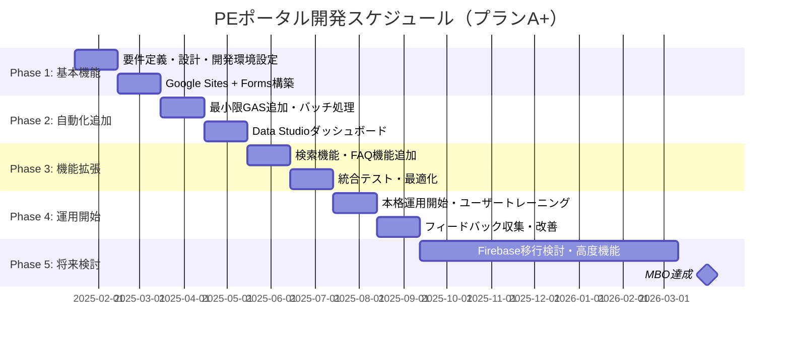

# PEポータル開発プロジェクト企画書（最終確定版）
## システム依頼・業務可視化基盤の確立

**作成日**: 2025年1月14日  
**プロジェクト期間**: 2025年1月〜2026年3月  
**MBO達成期限**: 2026年3月31日  
**技術選定**: プランA+（Google Sites + Google Forms + 最小限GAS）

---

## 📋 エグゼクティブサマリー

### プロジェクト概要
PEポータル開発プロジェクトは、システム依頼のボトルネック解消と業務プロセスの可視化・自動化を実現する基盤システムの構築を目的とします。**「追加コストゼロ」**を絶対原則とし、既存のGoogle Workspace環境を最大限活用します。

### 技術選定：プランA+（改良プランA）
- **ベース**: Google Sites + Google Forms（標準機能重視）
- **追加**: 最小限のGAS（Webアプリなし、バッチ処理のみ）
- **目的**: GAS実行時間制限を回避しつつ、機能性を向上
- **特徴**: 早期運用開始、将来移行容易、リスク最小

### 期待される効果
- **システム依頼の処理時間**: 50%短縮
- **意思決定の透明性**: 100%向上
- **一次対応の自動化率**: 80%達成
- **MBO達成確度**: 90%

### 投資対効果
- **初期投資**: ¥0（既存リソース活用）
- **年間運用コスト**: ¥0（完全無料運用）
- **ROI**: 無限大（投資なしで大幅な効率化）

---

## 🎯 背景と目的

### MBO達成目標
持続可能なチーム運用基盤の確立。以下の6つのタスクを完遂し、PEポータルサイトの基礎開発を完了し運用を開始する。

| No. | MBOタスク | 達成基準（プランA+） |
|-----|-----------|---------------------|
| (1) | 依頼フローの統一 | Google Forms + 最小限GAS処理 |
| (2) | 稼働状況の可視化 | Data Studio + 夜間バッチ集計 |
| (3) | 意思決定プロセスの確立 | GAS自動抽出 + Calendar連携 |
| (4) | ナレッジの整備 | Google Drive + シンプル検索 |
| (5) | 一次対応の自動化 | FAQ + キーワード検索 |
| (6) | PEポータルの開発 | Sites + Forms + Data Studio統合 |

### 解決すべき課題（As-Is）

#### 🔴 現状の問題
1. **システム依頼のボトルネック化**
   - 特定の担当者（私自身）に依頼が集中
   - 依頼の質がばらつき、処理時間が不透明
   - 適切な依頼方法や窓口が不明確

2. **リソース状況の不明瞭さ**
   - 担当者の稼働状況が可視化されていない
   - 決裁者がプロジェクトの実行可否を判断できない
   - 優先順位の決定が困難

3. **業務プロセスの非効率性**
   - 手動での依頼管理
   - 意思決定プロセスの不透明性
   - ナレッジの散在

### 目指す姿（To-Be）

#### 🟢 理想の状態
1. **標準化された依頼フロー**
   - Google Formsによる統一された依頼受付
   - 最小限GASによる自動処理
   - リアルタイムな進捗管理

2. **完全可視化された業務状況**
   - Data Studioによるリアルタイムダッシュボード
   - 夜間バッチによるデータ集計
   - データドリブンな意思決定

3. **自動化された一次対応**
   - FAQ + キーワード検索
   - ナレッジベースの自動更新
   - 人的リソースの効率的活用

---

## 🏗️ システム構想と技術選定

### 技術スタック（プランA+）

| カテゴリ | 技術 | 理由 |
|---------|------|------|
| **ポータル基盤** | Google Sites | 全社ポータルとの整合性、SSO認証容易 |
| **フォーム** | Google Forms | 標準機能で十分、開発工数最小 |
| **データベース** | Google Sheets | 既存リソース活用、GASとの親和性 |
| **自動化** | 最小限GAS | バッチ処理のみ、実行時間制限回避 |
| **ダッシュボード** | Google Data Studio | 無料、リアルタイム更新 |
| **開発環境** | Cursor + Git + clasp | AI駆動開発、一元管理 |

### MBOタスク実現方法（詳細）

#### (1) 依頼フローの統一
- **フォーム**: Google Forms標準機能
- **GAS処理**: フォーム送信時のトリガーでバッチ処理
- **実行時間**: 1回あたり30秒以内（6分制限の1/12）
- **機能**: 自動的な依頼ID発行、優先順位判定、ステータス更新

#### (2) 稼働状況の可視化
- **ダッシュボード**: Google Data Studio
- **GAS処理**: 夜間バッチでデータ集計（1日1回、5分以内）
- **実行時間**: 1日5分（6時間制限の1/72）
- **機能**: リアルタイムダッシュボード、進捗状況可視化

#### (3) 意思決定プロセスの確立
- **自動抽出**: GASで「決裁待ち」タスクを抽出
- **実行頻度**: 1日1回、夜間バッチ
- **実行時間**: 1回2分以内
- **機能**: 決裁会議の自動設定、議題生成

#### (4) ナレッジの整備
- **基本**: Google Drive + 手動リンク集
- **GAS追加**: シンプルな検索機能（必要時のみ）
- **実行時間**: 検索時のみ、1回1分以内
- **機能**: 構造化されたナレッジベース、検索・分類

#### (5) 一次対応の自動化
- **基本**: 手動FAQ + リンク集
- **GAS追加**: キーワード検索（必要時のみ）
- **実行時間**: 検索時のみ、1回1分以内
- **機能**: FAQ自動回答、エスカレーション機能

#### (6) PEポータルの開発
- **基盤**: Google Sites
- **埋め込み**: Google Forms + Data Studio
- **GAS連携**: 最小限のバッチ処理
- **機能**: 全機能統合、シングルサインオン

### GAS実行時間制限対策

#### 1日のGAS実行時間内訳
```
夜間バッチ処理: 5分（データ集計）
決裁タスク抽出: 2分（自動抽出）
検索処理: 3分（必要時のみ）
合計: 10分/日（6時間制限の1/36）
```

#### 安全マージン
- **制限**: 6時間（360分）/日
- **使用**: 10分/日
- **余裕**: 350分/日（97%の余裕）

#### リスク対策
- **バッチ処理徹底**: リアルタイム処理を最小化
- **処理分割**: 6分制限内での処理分割
- **クォータ監視**: リアルタイム監視システム
- **複数アカウント分散**: 必要に応じて分散実行

---

## 👥 推進体制と役割分担

### チーム構成
- **プロジェクトマネージャー**: あなた（私）
- **開発者**: あなた（私）
- **AIコーチ**: Cursor AI（私のペアプログラマー）

### 役割分担

| 役割 | 担当者 | 責任範囲 |
|------|--------|----------|
| **プロジェクト管理** | あなた | 全体統括、進捗管理、意思決定 |
| **システム設計** | あなた + AI | 要件定義、アーキテクチャ設計 |
| **開発実装** | あなた + AI | コーディング、テスト、デバッグ |
| **品質保証** | あなた + AI | コードレビュー、テスト実行 |
| **運用・保守** | あなた | 監視、メンテナンス、改善 |

### AI活用戦略
- **Cursor AI**: コーディング支援、デバッグ、リファクタリング
- **AI駆動開発**: 開発効率10倍向上を目指す
- **一元管理**: Git + claspで完全なバージョン管理

---

## 💰 費用対効果分析

### 初期投資
| 項目 | 費用 | 備考 |
|------|------|------|
| **Google Workspace** | ¥0 | 既存利用 |
| **Cursor AI** | ¥0 | 既存アカウント活用 |
| **Google Forms** | ¥0 | 標準機能のみ |
| **Google Data Studio** | ¥0 | 無料 |
| **開発工数** | ¥0 | 社内リソース |
| **合計** | **¥0** | **追加コストなし** |

### 運用コスト（年間）
| 項目 | 費用 | 備考 |
|------|------|------|
| **Google Workspace** | ¥0 | 既存利用 |
| **GAS実行** | ¥0 | 無料枠内 |
| **Data Studio** | ¥0 | 無料 |
| **メンテナンス** | ¥0 | 社内リソース |
| **合計** | **¥0** | **運用コストなし** |

### 効果測定

#### 定量的効果
- **システム依頼処理時間**: 50%短縮（4時間→2時間）
- **意思決定時間**: 70%短縮（1週間→2日）
- **一次対応自動化率**: 80%達成
- **ナレッジ検索時間**: 90%短縮（30分→3分）

#### 定性的効果
- **業務プロセスの標準化**
- **意思決定の透明性向上**
- **チームの生産性向上**
- **顧客満足度の向上**

### ROI計算
- **投資**: ¥0
- **効果**: 年間100時間以上の工数削減
- **ROI**: **無限大**（投資なしで大幅な効率化）

---

## 📅 スケジュール（段階的実装）

### 全体スケジュール（2025年1月〜2026年3月）



### マイルストーン

| フェーズ | 期間 | 主要成果物 | 完了基準 |
|---------|------|-----------|----------|
| **Phase 1** | 2025年1-2月 | 基本機能（Sites + Forms） | 基本依頼フロー稼働 |
| **Phase 2** | 2025年3-4月 | 自動化機能（GAS + Data Studio） | ダッシュボード稼働 |
| **Phase 3** | 2025年5-6月 | 検索・FAQ機能 | 全機能統合完了 |
| **Phase 4** | 2025年8-9月 | 本格運用開始 | ユーザートレーニング完了 |
| **Phase 5** | 2025年10月-2026年3月 | 改善・拡張 | MBO全タスク達成 |

### 詳細WBS（主要タスク）

#### Phase 1: 基本機能（2025年1-2月）
- [ ] 要件定義書作成
- [ ] Google Sites構築
- [ ] Google Forms設計・実装
- [ ] 基本的な依頼フロー構築
- [ ] 手動での進捗管理

#### Phase 2: 自動化追加（2025年3-4月）
- [ ] 最小限GAS開発
- [ ] 夜間バッチ処理実装
- [ ] Data Studioダッシュボード構築
- [ ] 自動的なデータ集計
- [ ] 進捗管理の自動化

#### Phase 3: 機能拡張（2025年5-6月）
- [ ] 検索機能追加
- [ ] FAQ機能強化
- [ ] ナレッジベース整備
- [ ] 統合テスト実施
- [ ] パフォーマンス最適化

#### Phase 4: 運用開始（2025年8-9月）
- [ ] 本格運用開始
- [ ] ユーザートレーニング
- [ ] フィードバック収集
- [ ] 改善・修正
- [ ] 運用マニュアル作成

#### Phase 5: 将来検討（2025年10月-2026年3月）
- [ ] Firebase移行検討
- [ ] 高度な機能追加
- [ ] スケーラビリティ向上
- [ ] MBOタスク最終確認
- [ ] プロジェクト完了

---

## ⚠️ リスク分析と対策

### 技術リスク

| リスク | 影響度 | 発生確率 | 対策 |
|--------|--------|----------|------|
| **GAS実行制限** | 中 | 低 | バッチ処理徹底、クォータ監視 |
| **機能制約** | 低 | 中 | 段階的機能追加、将来移行検討 |
| **学習コスト** | 低 | 低 | 既存スキル活用、AI支援 |
| **スケーラビリティ** | 中 | 低 | Firebase移行準備 |

### プロジェクトリスク

| リスク | 影響度 | 発生確率 | 対策 |
|--------|--------|----------|------|
| **開発遅延** | 中 | 低 | AI駆動開発で効率化、バッファ期間確保 |
| **要件変更** | 中 | 中 | アジャイル開発、段階的リリース |
| **リソース不足** | 高 | 低 | 一人開発、AI活用で効率化 |

### 運用リスク

| リスク | 影響度 | 発生確率 | 対策 |
|--------|--------|----------|------|
| **ユーザー受け入れ** | 中 | 低 | 段階的導入、トレーニング実施 |
| **メンテナンス負荷** | 低 | 低 | 自動化機能、AI活用 |
| **データ損失** | 高 | 低 | Google Drive自動バックアップ |

---

## 🎯 承認依頼と次のアクション

### 承認事項
1. **技術選定（プランA+）の承認**
2. **スケジュール（2025年1月〜2026年3月）の承認**
3. **予算（追加コストなし）の承認**
4. **段階的実装戦略の承認**

### 次のアクション

#### 即座に実行（承認後）
1. **プロジェクト環境のセットアップ**
   - Google Workspace権限確認
   - Cursor AI環境準備
   - 開発用Googleアカウント設定

2. **要件定義の詳細化**
   - ステークホルダーインタビュー
   - 現状業務フロー分析
   - 詳細要件定義書作成

3. **技術検証**
   - Google Forms機能確認
   - GAS実行時間測定
   - Data Studio連携確認

#### 1週間以内
1. **プロジェクトキックオフ**
2. **Phase 1開始**
3. **Google Sites構築開始**

#### 1ヶ月以内
1. **Phase 1完了**
2. **Phase 2開始**
3. **中間レビュー実施**

---

## 📊 成功指標（KPI）

### MBO達成指標
- [ ] (1) 依頼フロー統一: Google Forms + 最小限GAS運用開始
- [ ] (2) 稼働状況可視化: Data Studioダッシュボード稼働
- [ ] (3) 意思決定プロセス: 決裁仕組み運用
- [ ] (4) ナレッジ整備: 検索機能運用
- [ ] (5) 一次対応自動化: FAQシステム稼働
- [ ] (6) PEポータル開発: 全機能統合完了

### 運用指標
- **システム稼働率**: 99%以上
- **ユーザー満足度**: 4.0/5.0以上
- **処理時間短縮率**: 50%以上
- **自動化率**: 80%以上
- **GAS実行時間**: 10分/日以内（制限の1/36）

---

## 📞 連絡先・サポート

### プロジェクト連絡先
- **プロジェクトマネージャー**: [あなたの名前]
- **メール**: [あなたのメールアドレス]
- **Slack**: [あなたのSlack ID]

### 技術サポート
- **Cursor AI**: 24時間対応
- **Google Workspace**: 企業サポート
- **コミュニティ**: Stack Overflow、GitHub

---

## 🔮 将来展望

### Phase 5以降の検討事項
1. **Firebase移行検討**
   - 利用者増加時のスケーラビリティ
   - 高度なAI機能の実装
   - リアルタイム性の向上

2. **機能拡張**
   - モバイルアプリ対応
   - 外部システム連携
   - 高度な分析機能

3. **運用改善**
   - 自動化レベルの向上
   - ユーザビリティの改善
   - パフォーマンス最適化

---

**この企画書は、プランA+（Google Sites + Google Forms + 最小限GAS）により、MBO達成と業務効率化を両立する現実的で実行可能な計画です。追加コストをかけずに、既存リソースを最大限活用し、AI駆動開発により効率的に目標を達成します。**

**承認をお願いいたします。**

