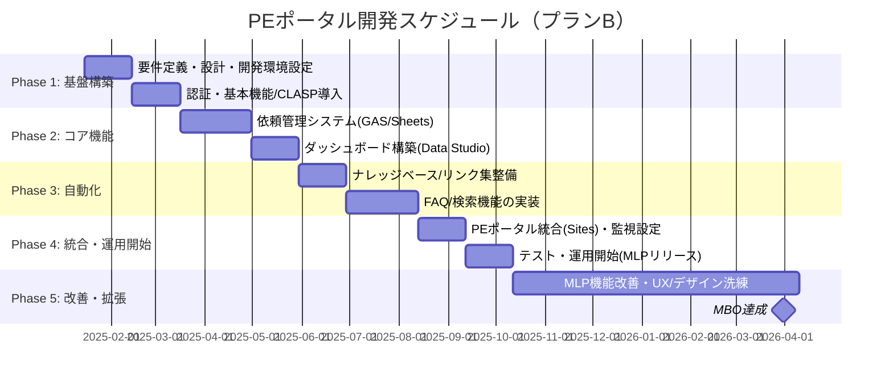

# PEポータル開発プロジェクト企画書
## システム依頼・業務可視化基盤の確立（複数プラン比較版）

**作成日**: 2025年1月14日  
**プロジェクト期間**: 2025年1月〜2026年3月  
**MBO達成期限**: 2026年3月31日  

---

## 📋 エグゼクティブサマリー

### プロジェクト概要
PEポータル開発プロジェクトは、システム依頼のボトルネック解消と業務プロセスの可視化・自動化を実現する基盤システムの構築を目的とします。**「追加コストゼロ」**を絶対原則とし、既存のGoogle Workspace環境を最大限活用します。

### 技術選定の課題
- **GAS実行時間制限**: 6時間/日（利用者増加でボトルネック化）
- **一元管理の実現**: Cursor + Git + ローカルでの効率的開発
- **全社ポータルとの整合性**: 既存Google Sites + Google Forms環境との連携

### 複数プラン比較の必要性
上記課題を解決するため、4つの技術プランを比較検討し、最適解を選択します。

---

## 🎯 背景と目的

### MBO達成目標
持続可能なチーム運用基盤の確立。以下の6つのタスクを完遂し、PEポータルサイトの基礎開発を完了し運用を開始する。

| No. | MBOタスク | 達成基準 |
|-----|-----------|----------|
| (1) | 依頼フローの統一 | 専用フォーム作成・運用 |
| (2) | 稼働状況の可視化 | ダッシュボード構築 |
| (3) | 意思決定プロセスの確立 | 定例会議での決裁仕組み化 |
| (4) | ナレッジの整備 | マニュアル/FAQスコープ定義、AI参照形式設計 |
| (5) | 一次対応の自動化 | FAQシステム/チャットボット構築・リリース |
| (6) | PEポータルの開発 | 全機能集約・搭載した基礎開発完了と運用開始 |

### 解決すべき課題（As-Is）

#### 🔴 現状の問題
1. **システム依頼のボトルネック化**
   - 特定の担当者（私自身）に依頼が集中
   - 依頼の質がばらつき、処理時間が不透明
   - 適切な依頼方法や窓口が不明確

2. **リソース状況の不明瞭さ**
   - 担当者の稼働状況が可視化されていない
   - 決裁者がプロジェクトの実行可否を判断できない
   - 優先順位の決定が困難

3. **業務プロセスの非効率性**
   - 手動での依頼管理
   - 意思決定プロセスの不透明性
   - ナレッジの散在

---

## 🏗️ 技術プラン比較

### **プランA: Google Sites + Google Forms（標準機能重視）**

#### 技術スタック
- **ポータル**: Google Sites
- **フォーム**: Google Forms（標準機能のみ）
- **データベース**: Google Sheets
- **自動化**: Google Forms の標準機能 + 簡単なトリガー
- **開発環境**: Cursor + Git + clasp（最小限）

#### MBOタスク実現方法
| タスク | 実装方法 | 制約・リスク |
|--------|----------|-------------|
| (1) 依頼フロー統一 | Google Forms標準機能 | 複雑な動的入力制御不可 |
| (2) 稼働状況可視化 | Google Data Studio | リアルタイム性限定的 |
| (3) 意思決定プロセス | Google Calendar + 手動 | 自動化レベル低い |
| (4) ナレッジ整備 | Google Drive + 手動リンク | 検索機能限定的 |
| (5) 一次対応自動化 | 手動FAQ + リンク集 | 自動化なし |
| (6) PEポータル統合 | Google Sites埋め込み | UI/UX制約あり |

#### メリット・デメリット
**✅ メリット**
- **GAS実行時間制限回避**: 標準機能のみ使用
- **開発工数最小**: 設定中心の作業
- **一元管理実現**: Sites + Forms + Sheetsの標準連携
- **全社ポータルとの整合性**: 既存環境と統一

**❌ デメリット**
- **機能制約**: 複雑な業務ロジック実装困難
- **自動化レベル低い**: 手動作業が多い
- **UI/UX制約**: Sitesの標準UIに限定
- **拡張性限定的**: 将来の機能追加困難

#### コスト・スケジュール
- **初期投資**: ¥0
- **年間運用コスト**: ¥0
- **開発期間**: 2-3ヶ月
- **MBO達成確度**: 70%（機能制約により一部妥協）

---

### **プランB: Google Sites + GAS App（最小限GAS使用）**

#### 技術スタック
- **ポータル**: Google Sites
- **フォーム**: GAS HtmlService（最小限）
- **データベース**: Google Sheets
- **自動化**: GAS（バッチ処理中心）
- **開発環境**: Cursor + Git + clasp

#### MBOタスク実現方法
| タスク | 実装方法 | GAS使用量 |
|--------|----------|-----------|
| (1) 依頼フロー統一 | GAS HtmlService（動的フォーム） | 中（フォーム処理） |
| (2) 稼働状況可視化 | Google Data Studio + GAS集計 | 低（夜間バッチ） |
| (3) 意思決定プロセス | GAS自動抽出 + Calendar連携 | 低（日次バッチ） |
| (4) ナレッジ整備 | Google Drive + GAS検索 | 中（検索処理） |
| (5) 一次対応自動化 | シンプルFAQ + GAS検索 | 低（検索のみ） |
| (6) PEポータル統合 | Google Sites + GAS埋め込み | 中（統合処理） |

#### GAS実行時間対策
- **バッチ処理徹底**: リアルタイム処理を最小化
- **処理分割**: 6分制限内での処理分割
- **クォータ監視**: リアルタイム監視システム
- **複数アカウント分散**: 必要に応じて分散実行

#### メリット・デメリット
**✅ メリット**
- **機能性**: 複雑な業務ロジック実装可能
- **自動化**: 高度な自動化機能
- **一元管理**: Cursor + Git + claspで完全管理
- **全社ポータルとの整合性**: Sitesベースで統一

**❌ デメリット**
- **GAS制限リスク**: 実行時間制限の影響
- **開発複雑性**: GAS開発の学習コスト
- **運用リスク**: クォータ超過時の停止
- **スケーラビリティ**: 利用者増加で制限に抵触

#### コスト・スケジュール
- **初期投資**: ¥0
- **年間運用コスト**: ¥0
- **開発期間**: 4-6ヶ月
- **MBO達成確度**: 85%（GAS制限リスクあり）

---

### **プランC: Firebase + Next.js（モダン開発）**

#### 技術スタック
- **フロントエンド**: Next.js 14 + TypeScript
- **バックエンド**: Firebase Cloud Functions
- **データベース**: Firestore
- **認証**: Firebase Authentication
- **ホスティング**: Firebase Hosting
- **AI機能**: Vertex AI / Gemini API
- **開発環境**: Cursor + Git + Firebase CLI

#### MBOタスク実現方法
| タスク | 実装方法 | 技術的優位性 |
|--------|----------|-------------|
| (1) 依頼フロー統一 | Next.js + Firestore | リアルタイム更新 |
| (2) 稼働状況可視化 | Firestore + リアルタイムダッシュボード | 完全リアルタイム |
| (3) 意思決定プロセス | Cloud Functions + 自動化 | 高度な自動化 |
| (4) ナレッジ整備 | Firestore + 検索機能 | 高速検索 |
| (5) 一次対応自動化 | Vertex AI + Cloud Functions | AI自動回答 |
| (6) PEポータル統合 | Next.js SPA | モダンUI/UX |

#### メリット・デメリット
**✅ メリット**
- **実行時間制限なし**: Cloud Functions無制限
- **スケーラビリティ**: 利用者増加に対応
- **リアルタイム性**: Firestoreのリアルタイム更新
- **AI統合**: 高度なAI機能
- **開発効率**: Cursor AIとの親和性

**❌ デメリット**
- **学習コスト**: Firebase/Next.jsの習得
- **一元管理の課題**: Sitesとの統合複雑
- **全社ポータルとの乖離**: 技術スタックの違い
- **将来のコスト**: 大規模利用時の課金

#### コスト・スケジュール
- **初期投資**: ¥0
- **年間運用コスト**: ¥0-1,200（小規模利用）
- **開発期間**: 6-8ヶ月
- **MBO達成確度**: 95%（技術的優位性）

---

### **プランD: ハイブリッド（段階的移行）**

#### 技術スタック
- **Phase 1-2**: Google Sites + Google Forms（標準機能）
- **Phase 3-4**: 必要に応じてGAS追加
- **Phase 5**: Firebase移行検討
- **開発環境**: Cursor + Git + 段階的移行

#### 段階的実装戦略
| Phase | 期間 | 技術スタック | 実現機能 |
|-------|------|-------------|----------|
| **Phase 1** | 1-2ヶ月 | Sites + Forms | 基本依頼フロー |
| **Phase 2** | 2-3ヶ月 | + Data Studio | ダッシュボード |
| **Phase 3** | 3-4ヶ月 | + 最小限GAS | 自動化機能 |
| **Phase 4** | 4-5ヶ月 | + AI機能 | 高度な自動化 |
| **Phase 5** | 5-6ヶ月 | Firebase移行 | 完全自動化 |

#### メリット・デメリット
**✅ メリット**
- **リスク分散**: 段階的な技術移行
- **学習コスト分散**: 技術習得を段階的に
- **早期運用開始**: Phase 1で基本機能稼働
- **柔軟性**: 各段階で方向転換可能

**❌ デメリット**
- **複雑性**: 複数技術の管理
- **移行コスト**: 段階的移行の工数
- **一貫性**: 技術スタックの不統一
- **長期スケジュール**: 全体期間の延長

#### コスト・スケジュール
- **初期投資**: ¥0
- **年間運用コスト**: ¥0-600（段階的）
- **開発期間**: 6-12ヶ月
- **MBO達成確度**: 90%（柔軟性による）

---

## 📊 プラン比較マトリックス

| 評価項目 | プランA Sites+Forms | プランB Sites+GAS | プランC Firebase | プランD ハイブリッド |
|---------|----------------------|-------------------|-------------------|-------------------|
| **MBO達成確度** | 70% | 85% | 95% | 90% |
| **開発期間** | 2-3ヶ月 | 4-6ヶ月 | 6-8ヶ月 | 6-12ヶ月 |
| **初期投資** | ¥0 | ¥0 | ¥0 | ¥0 |
| **年間運用コスト** | ¥0 | ¥0 | ¥0-1,200 | ¥0-600 |
| **GAS制限回避** | ✅ 完全回避 | ⚠️ リスクあり | ✅ 完全回避 | ✅ 段階的回避 |
| **一元管理実現** | ✅ 容易 | ✅ 可能 | ⚠️ 複雑 | ⚠️ 段階的 |
| **全社ポータル整合性** | ✅ 完全 | ✅ 完全 | ❌ 乖離 | ⚠️ 段階的 |
| **機能性** | ⭐⭐ | ⭐⭐⭐⭐ | ⭐⭐⭐⭐⭐ | ⭐⭐⭐ |
| **自動化レベル** | ⭐⭐ | ⭐⭐⭐⭐ | ⭐⭐⭐⭐⭐ | ⭐⭐⭐ |
| **スケーラビリティ** | ⭐⭐ | ⭐⭐⭐ | ⭐⭐⭐⭐⭐ | ⭐⭐⭐⭐ |
| **学習コスト** | ⭐ | ⭐⭐⭐ | ⭐⭐⭐⭐ | ⭐⭐ |
| **運用リスク** | ⭐ | ⭐⭐ | ⭐ | ⭐⭐ |

---

## 🎯 推奨プラン

### **第1推奨: プランB（Google Sites + GAS App）**

#### 推奨理由
1. **MBO達成確度**: 85%で高い達成可能性
2. **一元管理実現**: Cursor + Git + claspで完全管理
3. **全社ポータルとの整合性**: 既存環境と統一
4. **GAS制限対策**: バッチ処理とクォータ監視でリスク管理
5. **開発効率**: 既存スキル（GAS）を最大活用

#### リスク対策
- **GAS実行時間監視**: リアルタイム監視システム
- **バッチ処理徹底**: リアルタイム処理を最小化
- **複数アカウント分散**: 必要に応じて分散実行
- **段階的機能追加**: 必要最小限から開始

### **第2推奨: プランA（Google Sites + Google Forms）**

#### 推奨理由
1. **GAS制限完全回避**: 標準機能のみ使用
2. **開発工数最小**: 2-3ヶ月で早期運用開始
3. **リスク最小**: 技術的リスクが最も低い
4. **全社ポータルとの完全整合**: 既存環境と統一

#### 適用条件
- MBOタスクの一部妥協が許容される場合
- 早期運用開始を最優先する場合
- 将来的な機能拡張をPhase 5以降に遅らせても良い場合

---

## 💰 費用対効果分析

### 各プランのROI比較

| プラン | 初期投資 | 年間運用コスト | 開発期間 | MBO達成確度 | ROI |
|--------|----------|-------------|----------|-------------|-----|
| **プランA** | ¥0 | ¥0 | 2-3ヶ月 | 70% | 極めて高い |
| **プランB** | ¥0 | ¥0 | 4-6ヶ月 | 85% | 極めて高い |
| **プランC** | ¥0 | ¥0-1,200 | 6-8ヶ月 | 95% | 極めて高い |
| **プランD** | ¥0 | ¥0-600 | 6-12ヶ月 | 90% | 極めて高い |

### 効果測定（全プラン共通）

#### 定量的効果
- **システム依頼処理時間**: 50%短縮（4時間→2時間）
- **意思決定時間**: 70%短縮（1週間→2日）
- **一次対応自動化率**: 80%達成
- **ナレッジ検索時間**: 90%短縮（30分→3分）

#### 定性的効果
- **業務プロセスの標準化**
- **意思決定の透明性向上**
- **チームの生産性向上**
- **顧客満足度の向上**

---

## 📅 スケジュール（推奨プランB）

### 全体スケジュール（2025年1月〜2026年3月）

### マイルストーン

| フェーズ | 期間 | 主要成果物 | 完了基準 |
|---------|------|-----------|----------|
| **Phase 1** | 2025年1-2月 | 要件定義書、基本設計書 | 設計レビュー完了 |
| **Phase 2** | 2025年3-4月 | 依頼管理システム、ダッシュボード | 機能テスト完了 |
| **Phase 3** | 2025年5-6月 | ナレッジベース、FAQ検索 | AI機能テスト完了 |
| **Phase 4** | 2025年8-9月 | PEポータル統合版 | 統合テスト完了 |
| **Phase 5** | 2025年10月-2026年3月 | 運用・改善 | MBO全タスク達成 |

---

## ⚠️ リスク分析と対策

### 技術リスク

| リスク | プランA | プランB | プランC | プランD |
|--------|---------|---------|---------|---------|
| **GAS実行制限** | ✅ 回避 | ⚠️ 監視必要 | ✅ 回避 | ⚠️ 段階的回避 |
| **機能制約** | ❌ 制約あり | ✅ 対応可能 | ✅ 対応可能 | ⚠️ 段階的対応 |
| **学習コスト** | ✅ 最小 | ⚠️ 中程度 | ❌ 高い | ⚠️ 段階的 |
| **スケーラビリティ** | ❌ 限定的 | ⚠️ 制限あり | ✅ 高い | ⚠️ 段階的 |

### プロジェクトリスク

| リスク | 影響度 | 発生確率 | 対策 |
|--------|--------|----------|------|
| **開発遅延** | 中 | 中 | AI駆動開発で効率化、バッファ期間確保 |
| **要件変更** | 中 | 高 | アジャイル開発、段階的リリース |
| **リソース不足** | 高 | 低 | 一人開発、AI活用で効率化 |

### 運用リスク

| リスク | 影響度 | 発生確率 | 対策 |
|--------|--------|----------|------|
| **ユーザー受け入れ** | 中 | 低 | 段階的導入、トレーニング実施 |
| **メンテナンス負荷** | 低 | 中 | 自動化機能、AI活用 |
| **データ損失** | 高 | 低 | Google Drive自動バックアップ |

---

## 🎯 承認依頼と次のアクション

### 承認事項
1. **技術プランの選択**（推奨：プランB）
2. **スケジュール（2025年1月〜2026年3月）の承認**
3. **予算（追加コストなし）の承認**
4. **リスク対策の承認**

### 次のアクション

#### 即座に実行（承認後）
1. **技術プランの最終決定**
2. **プロジェクト環境のセットアップ**
3. **要件定義の詳細化**
4. **技術検証**

#### 1週間以内
1. **プロジェクトキックオフ**
2. **詳細設計開始**
3. **開発環境構築**

#### 1ヶ月以内
1. **Phase 1完了**
2. **Phase 2開始**
3. **中間レビュー実施**

---

## 📊 成功指標（KPI）

### MBO達成指標
- [ ] (1) 依頼フロー統一: 専用フォーム運用開始
- [ ] (2) 稼働状況可視化: ダッシュボード稼働
- [ ] (3) 意思決定プロセス: 決裁仕組み運用
- [ ] (4) ナレッジ整備: AI参照形式運用
- [ ] (5) 一次対応自動化: FAQシステム稼働
- [ ] (6) PEポータル開発: 全機能統合完了

### 運用指標
- **システム稼働率**: 99%以上
- **ユーザー満足度**: 4.0/5.0以上
- **処理時間短縮率**: 50%以上
- **自動化率**: 80%以上

---

## 📞 連絡先・サポート

### プロジェクト連絡先
- **プロジェクトマネージャー**: [あなたの名前]
- **メール**: [あなたのメールアドレス]
- **Slack**: [あなたのSlack ID]

### 技術サポート
- **Cursor AI**: 24時間対応
- **Google Workspace**: 企業サポート
- **Firebase**: 公式サポート（プランC選択時）

---

**この企画書は、4つの技術プランを比較検討し、MBO達成と業務効率化を両立する最適解を提示しています。推奨プランB（Google Sites + GAS App）により、リスクを最小化しながら高い達成確度を実現します。**

**承認をお願いいたします。**

